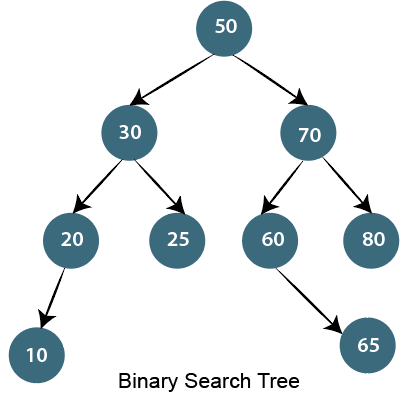

## Basic Algorithm Questions

- **Why do we use arrays instead of other data structures?**

  - Because we can directly access any element in the array by adding the offset to the pointer, we can look up any element in the same amount of time, regardless of the size of the array. This means that getting MyArray[1000] would take the same amount of time as getting MyArray[5].

- **Why would someone want to use a linked-list over an array?**

  - It's easier to store data of different sizes in a linked list. An array assumes every element is exactly the same size.
  - As you mentioned, it's easier for a linked list to grow organically. An array's size needs to be known ahead of time, or re-created when it needs to grow.
  - Shuffling a linked list is just a matter of changing what points to what. Shuffling an array is more complicated and/or takes more memory.
  - As long as your iterations all happen in a "foreach" context, you don't lose any performance in iteration.

- **Please explain how does an Array differ from a Linked List?**

  - **Additional Memory** – For each element belonging to a linked list, extra memory space is required for storing the pointer. Arrays have no such requirement
  - **Cache** – In comparison to linked lists, arrays have better cache locality, which can significantly enhance the performance in various scenarios
  - **Insertion and Deletion** – It is easy to add or delete elements in a linked list. Inserting and deleting elements for an array is comparatively expensive
  - **Random Access** – Linked lists do not allow random access, while arrays do
  - **Size** – While the size of an array is fixed, the size of a linked list is dynamic

- **Could you give a brief explanation of the various approaches for developing algorithms?**

  - Divide and Conquer – Involves dividing the entire problem into a number of subproblems and then solving each of them independently
  - Dynamic Programming – Identical to the divide and conquer approach with the exception that all sub-problems are solved together
  - Greedy Approach – Finds a solution by choosing the next best option

- **Please enumerate some examples of greedy and divide and conquer algorithms.**

  - Some examples of algorithms that follow greedy approach are:

    - Dijkstra’s Minimal Spanning Tree
    - Graph – Map Coloring
    - Graph – Vertex Cover
    - Job Scheduling Problem
    - Knapsack Problem
    - Kruskal’s Minimal Spanning Tree
    - Prim’s Minimal Spanning Tree
    - Travelling Salesman

  - Following are some notable instances of the divide and conquer approach:

    - Binary Search
    - Closest Pair (or Points)
    - Merge Sort
    - Quick Sort
    - Strassen’s Matrix Multiplication

- **Please explain recursion.**

  - The ability to allow a function or module to call itself is called recursion. Either a function f calls itself directly or calls another function ‘g’ that in turn calls the function ‘f. The function f is known as the recursive function and it follows the recursive properties:

    - _Base criteria_ – Where the recursive function stops calling itself
    - _Progressive approach_ – Where the recursive function tries to meet the base criteria in each iteration

- **What is a queue? How is it different from a stack?**

  - A queue is a form of linear structure that follows the FIFO (First In First Out) approach for accessing elements. Dequeue, enqueue, front, and rear are basic operations on a queue. Like a stack, a queue can be implemented using arrays and linked lists.
  - In a stack, the item that is most recently added is removed first. Contrary to this, the item least recently added is removed first in case of a queue.

- Please enumerate the various operations that can be performed on a data structure.
  Answer: Following are the various operations that can be performed on a data structure:

  - **Deletion** – Deleting an existing element from the data structure
  - **Insertion** – Adding a new element to the data structure
  - **Searching** – Find the location of an element, if it exists, in the data structure
  - **Sorting** – Arranging elements of the data structure in:
    - Ascending or descending order for numerical data
    - Dictionary order for alphanumeric data
  - **Traversal** – Accessing each element of the data structure once for processing

- **Please explain stack and also mention some of its important applications.**

  - Stack is a linear data structure that follows either LIFO (Last In First Out) or FILO (First In Last Out) approach for accessing elements. Push, pop, and peek are the basic operations of a stack.

  - applications of a stack are:

    - Check for balanced parentheses in an expression
    - Evaluation of a postfix expression
    - Implement two stacks in an array
    - Infix to postfix conversion
    - Reverse a string

- **When can you tell that a Memory Leak will occur?**

  - A memory leak occurs when a program does not free a block of memory allocated dynamically.

- **List the data structures which are used in RDBMS, Network Data Modal, and Hierarchical Data Model.**

  - RDBMS uses Array data structure
  - Network data model uses Graph
  - Hierarchal data model uses Trees

- **Which data structure is used to perform recursion?**

  - Stack data structure is used in recursion due to its last in first out nature. Operating system maintains the stack in order to save the iteration variables at each function call

- **List the area of applications where stack data structure can be used?**

  - Expression evaluation
  - Backtracking
  - Memory Management
  - Function calling and return

- **What are the operations that can be performed on a stack?**

  - Push Operations
  - Pop Operations
  - Peek Operations

- List some applications of queue data structure.

  - Queues are widely used as waiting lists for a single shared resource like a printer, disk, CPU.
  - Queues are used in the asynchronous transfer of data (where data is not being transferred at the same rate between two processes) for eg. pipes, file IO, sockets.
  - Queues are used as buffers in most of the applications like MP3 media player, CD player, etc.
  - Queues are used to maintain the playlist in media players to add and remove the songs from the play-list.
  - Queues are used in operating systems for handling interrupts.

- **What is a stack Overflow?**

  - Ans

- **Which data structure suits the most in the tree construction?**

  - Queue data structure

- **Which data structures are used in BFS and DFS algorithm?**

  - In BFS algorithm, Queue data structure is used.
  - In DFS algorithm, Stack data structure is used.

- **In what scenario, Binary Search can be used?**

  - Binary Search algorithm is used to search an already sorted list. The algorithm follows divide and conqer approach

- **What are the applications of Graph data structure?**

  - Graphs are used in circuit networks where points of connection are drawn as vertices and component wires become the edges of the graph.
  - Graphs are used in transport networks where stations are drawn as vertices and routes become the edges of the graph.
  - Graphs are used in maps that draw cities/states/regions as vertices and adjacency relations as edges.
  - Graphs are used in program flow analysis where procedures or modules are treated as vertices and calls to these procedures are drawn as edges of the graph.

- **What are Binary trees?**

  - A binary Tree is a special type of generic tree in which, each node can have at most two children. Binary tree is generally partitioned into three disjoint subsets, i.e. the root of the node, left sub-tree and Right binary sub-tree.

- **What are the advantages of Linked List over an array?**

  - The size of a linked list can be incremented at runtime which is impossible in the case of the array.
  - The List is not required to be contiguously present in the main memory, if the contiguous space is not available, the nodes can be stored anywhere in the memory connected through the links.
  - The List is dynamically stored in the main memory and grows as per the program demand while the array is statically stored in the main memory, size of which must be declared at compile time.
  - The number of elements in the linked list are limited to the available memory space while the number of elements in the array is limited to the size of an array.

- **Name some of the sorting algorithms**

  - Selection Sort
  - Bubble Sort
  - Insertion Sort
  - Merge Sort
  - Quick Sort
  - Heap Sort
  - Counting Sort
  - Radix Sort
  - Bucket Sort

- **Name some of the search algorithms**

  - Binary Search
  - Exponential Search
  - Jump Search
  - Linear Search

- **Name some of the graph algorithms**

  - Breadth First Search (BFS)
  - Depth First Search (DFS)
  - Dijkstra's Algorithm
  - Floyd Warshall Algorithm

- **What are greedy algorithms?**

  - greedy algorithm picks the best immediate choice and never reconsiders its choices. In terms of optimizing a solution, this simply means that the greedy solution will try and find local optimum solutions - which can be many - and might miss out on a global optimum solution.

  - Imagine you are going for hiking and your goal is to reach the highest peak possible. You already have the map before you start, but there are thousands of possible paths shown on the map. You are too lazy and simply don’t have the time to evaluate each of them. Screw the map! You started hiking with a simple strategy – be greedy and short-sighted. Just take paths that slope upwards the most. This seems like a good strategy for hiking. But is it always the best ?

  - After the trip ended and your whole body is sore and tired, you look at the hiking map for the first time. Oh my god! There’s a muddy river that I should’ve crossed, instead of keep walking upwards. This means that a greedy algorithm picks the best immediate choice and never reconsiders its choices. In terms of optimizing a solution, this simply means that the greedy solution will try and find local optimum solutions - which can be many - and might miss out on a global optimum solution.

- **Name some of the Divide and Conquer Algorithms**

  - **Binary Search** is a searching algorithm. In each step, the algorithm compares the input element x with the value of the middle element in array. If the values match, return the index of middle. Otherwise, if x is less than the middle element, then the algorithm recurs for left side of middle element, else recurs for right side of middle element.

  - **Quicksort** is a sorting algorithm. The algorithm picks a pivot element, rearranges the array elements in such a way that all elements smaller than the picked pivot element move to left side of pivot, and all greater elements move to right side. Finally, the algorithm recursively sorts the subarrays on left and right of pivot element.

  - **Merge Sort** is also a sorting algorithm. The algorithm divides the array in two halves, recursively sorts them and finally merges the two sorted halves.

  - **Closest Pair of Points** The problem is to find the closest pair of points in a set of points in x-y plane. The problem can be solved in O(n^2) time by calculating distances of every pair of points and comparing the distances to find the minimum. The Divide and Conquer algorithm solves the problem in O(nLogn) time.

  - **Strassen’s Algorithm** is an efficient algorithm to multiply two matrices. A simple method to multiply two matrices need 3 nested loops and is O(n^3). Strassen’s algorithm multiplies two matrices in O(n^2.8974) time.

  - **Cooley–Tukey Fast Fourier Transform (FFT)** algorithm is the most common algorithm for FFT. It is a divide and conquer algorithm which works in O(nlogn) time.

  - The Karatsuba algorithm was the first multiplication algorithm asymptotically faster than the quadratic “grade school” algorithm. It reduces the multiplication of two n-digit numbers to at most to n^1.585(which is approximation of log of 3 in base 2) single digit products. It is therefore faster than the classical algorithm, which requires n^2 single-digit products.

- **How does insertion sort work?**

  - Insertion sort takes elements of the array sequentially, and maintains a sorted subarray to the left of the current point. It does this by taking an element, finding its correct position in the sorted array, and shifting all following elements by 1, leaving a space for the element to be inserted.

- **Heap Sort**

  - Heapsort starts by building a max heap. A binary max heap is a nearly complete binary tree in which each parent node is larger or equal to its children. The heap is stored in the same memory in which the original array elements are. Once the heap is formed, it completely replaces the array. After that, we take and remove the first element, restore the heap property, thus reducing the heap size by 1, after which we place the max element at the end of that memory. This is repeated until we empty out the heap, resulting in the smallest element being in the first place, and the following elements being sequentially larger.

- **Quick Sort**

  - Quicksort is performed by taking the first (leftmost) element of the array as a pivot point. We then compare it to each following element. When we find one that is smaller, we move it to the left. The moving is performed quickly by swapping that element with the first element after the pivot point, and then swapping the pivot point with the element after it. After going through the whole array, we take all points on the left of the pivot and call quicksort on that subarray, and we do the same to all points on the right of the pivot. The recursion is performed until we reach subarrays of 0-1 elements in length.

- **Merge Sort**

  - Merge sort, is a divide-and-conquer approach for sorting the data. In a sequence of data, adjacent ones are merged and sorted to create bigger sorted lists. These sorted lists are then merged again to form an even bigger sorted list, which continues until you have one single sorted list.

  - Merge sort recursively halves the given array. Once the subarrays reach trivial length, merging begins. Merging takes the smallest element between two adjacent subarrays and repeats that step until all elements are taken, resulting in a sorted subarray. The process is repeated on pairs of adjacent subarrays until we arrive at the starting array, but sorted.

- **What is a Binary Search Tree?**

  - The binary search tree is a special type of data structure which has the following properties.

    - Nodes which are less than root will be in the left subtree.
    - Nodes which are greater than root (i.e., contains more value) will be right subtree.
    - A binary search tree should not have duplicate nodes.
    - Both sides subtree (i.e., left and right) also should be a binary search tree.


    

- **Which data structure can be used for efficiently building a word dictionary and Spell Checker?**

  - The answer depends upon the functionalists required in Spell Checker and availability of memory. For example following are few possibilities.

  - Hashing is one simple option for this. We can put all words in a hash table. Refer this paper which compares hashing with self-balancing Binary Search Trees and Skip List, and shows that hashing performs better.

  - Hashing doesn’t support operations like prefix search. Prefix search is something where a user types a prefix and your dictionary shows all words starting with that prefix. Hashing also doesn’t support efficient printing of all words in dictionary in alphabetical order and nearest neighbor search.

  - If we want both operations, look up and prefix search, Trie is suited. With Trie, we can support all operations like insert, search, delete in O(n) time where n is length of the word to be processed. Another advantage of Trie is, we can print all words in alphabetical order which is not possible with hashing.

  - The disadvantage of Trie is, it requires lots of space. If space is concern, then Ternary Search Tree can be preferred. In Ternary Search Tree, time complexity of search operation is O(h) where h is height of the tree. Ternary Search Trees also supports other operations supported by Trie like prefix search, alphabetical order printing and nearest neighbor search.

  - If we want to support suggestions, like google shows “did you mean …”, then we need to find the closest word in dictionary. The closest word can be defined as the word that can be obtained with minimum number of character transformations (add, delete, replace). A Naive way is to take the given word and generate all words which are 1 distance (1 edit or 1 delete or 1 replace) away and one by one look them in dictionary. If nothing found, then look for all words which are 2 distant and so on. There are many complex algorithms for this. As per the wiki page, The most successful algorithm to date is Andrew Golding and Dan Roth’s Window-based spelling correction algorithm.

- **Which data structures are applied when dealing with a recursive function?**

  - Recursion, is a function that calls itself based on a terminating condition, makes use of the stack. Using LIFO, a call to a recursive function saves the return address so that it knows how to return to the calling function after the call terminates.

- **When is a binary search best applied?**

  - A binary search is an algorithm that is best applied to search a list when the elements are already in order or sorted. The list is searched starting in the middle, such that if that middle value is not the target search key, it will check to see if it will continue the search on the lower half of the list or the higher half. The split and search will then continue in the same manner.

- **What are multidimensional arrays?**

  - Multidimensional arrays make use of multiple indexes to store data. It is useful when storing data that cannot be represented using single dimensional indexing, such as data representation in a board game, tables with data stored in more than one column.

- **What is the primary advantage of a linked list?**

  - A linked list is an ideal data structure because it can be modified easily. This means that editing a linked list works regardless of how many elements are in the list.

- **How does variable declaration affect memory allocation?**

  - The amount of memory to be allocated or reserved would depend on the data type of the variable being declared. For example, if a variable is declared to be of integer type, then 32 bits of memory storage will be reserved for that variable.

- **What is the advantage of the heap over a stack?**

  - The heap is more flexible than the stack. That’s because memory space for the heap can be dynamically allocated and de-allocated as needed. However, the memory of the heap can at times be slower when compared to that stack.

- **How do you insert a new item in a binary search tree?**

  - Assuming that the data to be inserted is a unique value (that is, not an existing entry in the tree), check first if the tree is empty. If it’s empty, just insert the new item in the root node. If it’s not empty, refer to the new item’s key. If it’s smaller than the root’s key, insert it into the root’s left subtree, otherwise, insert it into the root’s right subtree.

- **What is the minimum number of nodes that a binary tree can have?**

  - A binary tree can have a minimum of zero nodes, which occurs when the nodes have NULL values. Furthermore, a binary tree can also have 1 or 2 nodes.

- **In what data structures are pointers applied?**

  - Pointers that are used in linked list have various applications in the data structure. Data structures that make use of this concept include the Stack, Queue, Linked List and Binary Tree.

- **What is the minimum number of queues needed when implementing a priority queue?**

  - The minimum number of queues needed in this case is two. One queue is intended for sorting priorities while the other queue is used for actual storage of data.

- **Which sorting algorithm is considered the fastest?**

  - There are many types of sorting algorithms: quick sort, bubble sort, balloon sort, radix sort, merge sort, etc. Not one can be considered the fastest because each algorithm is designed for a particular data structure and data set. It would depend on the data set that you would want to sort.

- **Differentiate STACK from ARRAY.**

  - Stack follows a LIFO pattern. It means that data access follows a sequence wherein the last data to be stored when the first one to be extracted. Arrays, on the other hand, does not follow a particular order and instead can be accessed by referring to the indexed element within the array.

- **basic algorithm for searching a binary search tree.**

  1. if the tree is empty, then the target is not in the tree, end search
  2. if the tree is not empty, the target is in the tree
  3. check if the target is in the root item
  4. if a target is not in the root item, check if a target is smaller than the root’s value
  5. if a target is smaller than the root’s value, search the left subtree
  6. else, search the right subtree

- **What is a dequeue?**

  - A dequeue is a double-ended queue. This is a structure wherein elements can be inserted or removed from either end.

- **What is a bubble sort and how do you perform it?**

  - A bubble sort is one sorting technique that can be applied to data structures such as an array. It works by comparing adjacent elements and exchanges their values if they are out of order. This method lets the smaller values “bubble” to the top of the list, while the larger value sinks to the bottom.

- **What are the parts of a linked list?**

  - A linked list typically has two parts: the head and the tail. Between the head and tail lie the actual nodes. All these nodes are linked sequentially.

- **Differentiate linear from a nonlinear data structure.**

  - The linear data structure is a structure wherein data elements are adjacent to each other. Examples of linear data structure include arrays, linked lists, stacks, and queues. On the other hand, a non-linear data structure is a structure wherein each data element can connect to more than two adjacent data elements. Examples of nonlinear data structure include trees and graphs.

- **What are doubly linked lists?**

  - Doubly linked lists are a special type of linked list wherein traversal across the data elements can be done in both directions. This is made possible by having two links in every node, one that links to the next node and another one that connects to the previous node.

- **What is Fibonacci search?**

  - Fibonacci search is a search algorithm that applies to a sorted array. It makes use of a divide-and-conquer approach that can significantly reduce the time needed in order to reach the target element.

- **How do you search for a target key in a linked list?**

  - To find the target key in a linked list, you have to apply sequential search. Each node is traversed and compared with the target key, and if it is different, then it follows the link to the next node. This traversal continues until either the target key is found or if the last node is reached.

- **Write an algorithm to insert a node in the Binary search tree?**

  Insert node operation is a smooth operation. You need to compare it with the root node and traverse left (if smaller) or right (if greater) according to the value of the node to be inserted.

  **Algorithm:**

  - Make the root node as the current node
  - If the node to be inserted < root
    - If it has left child, then traverse left
    - If it does not have left child, insert node here
  - If the node to be inserted > root
    - If it has the right child, traverse right
    - If it does not have the right child, insert node here.

- **Explain how the encryption algorithm works?**

  - Encryption is the technique of converting plaintext into a secret code format it is also called as "Ciphertext." To convert the text, the algorithm uses a string of bits called as "keys" for calculations. The larger the key, the higher the number of potential patterns for Encryption. Most of the algorithm use codes fixed blocks of input that have a length of about 64 to 128 bits, while some uses stream method for encryption.

- **What are Divide and Conquer algorithms? Describe how they work. Can you give any common examples of the types of problems where this approach might be used?**

  - Divide and Conquer algorithms are a paradigm for solving problems that involve several basic steps. First, we divide the problem into smaller pieces and work to solve each of them independently. Once we’ve solved all of the pieces, we take all of the resulting smaller solutions and combine them into a single integrated comprehensive solution.

  - This process can be performed recursively; that is, each “sub problem” can itself be subdivided into even smaller parts if necessary.. This recursive division of the problem is performed until each individual problem is small enough to become relatively trivial to solve.

  - Some common examples of problems that lend themselves well to this approach are binary search, sorting algorithms (e.g., Merge Sort, Quicksort), optimization of computationally complex mathematical operations (Exponentiation, FFT, Strassen’s algorithm), and others.

- **Given a big string of characters, how to efficiently find the first unique character in it?**

  - The efficient solution is to use character as an index in a count array. Traverse the given string and store index of first occurrence of every character, also store count of occurrences. Then traverse the count array and find the smallest index with count as 1. See find the first unique character for more details.
  - [Code solution](https://www.geeksforgeeks.org/given-a-string-find-its-first-non-repeating-character/)

- **Given a linked list which is sorted, how will you insert in sorted way**

  - Given a sorted linked list and a value to insert, write a function to insert the value in a sorted way.
  - [2, 5, 7, 10, 15]
  - Output after adding 9 => [2, 5, 7, 9, 10, 15]
  - [Code solution](https://www.geeksforgeeks.org/given-a-linked-list-which-is-sorted-how-will-you-insert-in-sorted-way/)

- **Algorithm to swap two valubes a and b**

```
function swap(a,b){
  temp = a
  a = b
  b = temp
  return [a,b]
}
```
