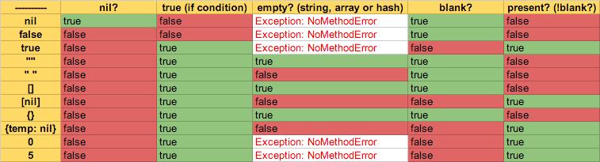

## Ruby Interview Questions

Table of Contents

- [How to generate a random string in Ruby](#how-to-generate-a-random-string-in-ruby)
- [How to check if a specific key is present in a hash or not?](#how-to-check-if-a-specific-key-is-present-in-a-hash-or-not)
- [Ruby function to remove all white spaces?](#ruby-function-to-remove-all-white-spaces)
- [How to understand nil vs. empty vs. blank in Rails (and Ruby)](#how-to-understand-nil-vs-empty-vs-blank-in-rails-and-ruby)
- [How to call shell commands from Ruby?](#how-to-call-shell-commands-from-ruby)
- [What is attr_accessor in Ruby?](#what-is-attraccessor-in-ruby)
- [Why is it bad style to `rescue Exception => e` in Ruby?](#why-is-it-bad-style-to-rescue-exception-e-in-ruby)
- [What does `class << self` do in Ruby? (class << self idiom)](#what-does-class-self-do-in-ruby-class-self-idiom)

### How to generate a random string in Ruby

```ruby
(0...8).map { (65 + rand(26)).chr }.join
```

I spend too much time golfing.

```ruby
(0...50).map { ('a'..'z').to_a[rand(26)] }.join
```

And a last one that's even more confusing, but more flexible and wastes fewer cycles:

```ruby
o = [('a'..'z'), ('A'..'Z')].map(&:to_a).flatten
string = (0...50).map { o[rand(o.length)] }.join
```

### **How to check if a specific key is present in a hash or not?**

`session.key?("user")`

### Ruby function to remove all white spaces?

If you want to remove only leading and trailing whitespace (like PHP's trim) you can use `.strip`, but if you want to remove all whitespace, you can use `.gsub(/\s+/, "")` instead .

### **How to understand nil vs. empty vs. blank in Rails (and Ruby)**

`.nil?` can be used on any object and is true if the object is nil.

`.empty?` can be used on strings, arrays and hashes and returns true if:

```
String length == 0
Array length == 0
Hash length == 0
```

Running `.empty?` on something that is nil will throw a NoMethodError.

That is where `.blank?` comes in. It is implemented by Rails and will operate on any object as well as work like `.empty?` on strings, arrays and hashes.

```
nil.blank? == true
false.blank? == true
[].blank? == true
{}.blank? == true
"".blank? == true
5.blank? == false
0.blank? == false
```

`.blank?` also evaluates true on strings which are non-empty but contain only whitespace:

```
"  ".blank? == true
"  ".empty? == false
```

Rails also provides `.present?`, which returns the negation of `.blank?`.

Array gotcha: blank? will return false even if all elements of an array are blank. To determine blankness in this case, use all? with blank?, for example:

```
[ nil, '' ].blank? == false
[ nil, '' ].all? &:blank? == tru
```



- **How to call shell commands from Ruby?**

  This explanation is based on a commented [Ruby script][1] from a friend of mine. If you want to improve the script, feel free to update it at the link.

  First, note that when Ruby calls out to a shell, it typically calls `/bin/sh`, _not_ Bash. Some Bash syntax is not supported by `/bin/sh` on all systems.

  Here are ways to execute a shell script:

      cmd = "echo 'hi'" # Sample string that can be used

  1.  <code>Kernel#\`</code> , commonly called backticks – <code>\`cmd\`</code>

      This is like many other languages, including Bash, PHP, and Perl.

      Returns the result (i.e. standard output) of the shell command.

      Docs: http://ruby-doc.org/core/Kernel.html#method-i-60

                value = `echo 'hi'`
                value = `#{cmd}`

  2.  Built-in syntax, `%x( cmd )`

      Following the `x` character is a delimiter, which can be any character.
      If the delimiter is one of the characters `(`, `[`, `{`, or `<`,
      the literal consists of the characters up to the matching closing delimiter,
      taking account of nested delimiter pairs. For all other delimiters, the
      literal comprises the characters up to the next occurrence of the
      delimiter character. String interpolation `#{ ... }` is allowed.

      Returns the result (i.e. standard output) of the shell command, just like the backticks.

      Docs: http://www.ruby-doc.org/docs/ProgrammingRuby/html/language.html

              value = %x( echo 'hi' )
              value = %x[ #{cmd} ]

  3.  `Kernel#system`

      Executes the given command in a subshell.

      Returns `true` if the command was found and run successfully, `false` otherwise.

      Docs: http://ruby-doc.org/core/Kernel.html#method-i-system

            wasGood = system( "echo 'hi'" )
            wasGood = system( cmd )

  4.  `Kernel#exec`

      Replaces the current process by running the given external command.

      Returns none, the current process is replaced and never continues.

      Docs: http://ruby-doc.org/core/Kernel.html#method-i-exec

            exec( "echo 'hi'" )
            exec( cmd ) # Note: this will never be reached because of the line above

  Here's some extra advice:
  `$?`, which is the same as `$CHILD_STATUS`, accesses the status of the last system executed command if you use the backticks, `system()` or `%x{}`.
  You can then access the `exitstatus` and `pid` properties:

            $?.exitstatus

  For more reading see:

  - http://www.elctech.com/blog/i-m-in-ur-commandline-executin-ma-commands
  - http://blog.jayfields.com/2006/06/ruby-kernel-system-exec-and-x.html
  - http://tech.natemurray.com/2007/03/ruby-shell-commands.html


          [1]: http://gist.github.com/4069

- **What is attr_accessor in Ruby?**

  Let's say you have a class `Person`.

  ```ruby
  class Person
  end

  person = Person.new
  person.name # => no method error
  ```

  Obviously we never defined method `name`. Let's do that.

  ```ruby
  class Person
    def name
    @name # simply returning an instance variable @name
    end
  end

  person = Person.new
  person.name # => nil
  person.name = "Dennis" # => no method error
  ```

  Aha, we can read the name, but that doesn't mean we can assign the name. Those are two different methods. The former is called _reader_ and latter is called _writer_. We didn't create the writer yet so let's do that.

  ```ruby
  class Person
    def name
    @name
    end

    def name=(str)
      @name = str
    end

  end

  person = Person.new
  person.name = 'Dennis'
  person.name # => "Dennis"
  ```

  Awesome. Now we can write and read instance variable `@name` using reader and writer methods. Except, this is done so frequently, why waste time writing these methods every time? We can do it easier.

  ```ruby
  class Person
    attr_reader :name
    attr_writer :name
  end
  ```

  Even this can get repetitive. When you want both reader and writer just use accessor!

  ```ruby
  class Person
    attr_accessor :name
  end

  person = Person.new
  person.name = "Dennis"
  person.name # => "Dennis"
  ```

  Works the same way! And guess what: the instance variable `@name` in our person object will be set just like when we did it manually, so you can use it in other methods.

  ```ruby
  class Person
    attr_accessor :name

    def greeting
      "Hello #{@name}"
    end

  end

  person = Person.new
  person.name = "Dennis"
  person.greeting # => "Hello Dennis"
  ```

  That's it. In order to understand how `attr_reader`, `attr_writer`, and `attr_accessor` methods actually generate methods for you, read other answers, books, ruby docs.

- **Why is it bad style to `rescue Exception => e` in Ruby?**

  **TL;DR**: Use `StandardError` instead for general exception catching. When the original exception is re-raised (e.g. when rescuing to log the exception only), rescuing `Exception` is probably okay.

  `Exception` is the root of [Ruby's exception hierarchy](http://rubylearning.com/images/exception.jpg), so when you `rescue Exception` you rescue from _everything_, including subclasses such as `SyntaxError`, `LoadError`, and `Interrupt`.

  Rescuing `Interrupt` prevents the user from using <kbd>CTRL</kbd><kbd>C</kbd> to exit the program.

  Rescuing `SignalException` prevents the program from responding correctly to signals. It will be unkillable except by `kill -9`.

  Rescuing `SyntaxError` means that `eval`s that fail will do so silently.

- **What does `class << self` do in Ruby? (class << self idiom)**

  First, the `class << foo` syntax opens up `foo`'s singleton class (eigenclass). This allows you to specialise the behaviour of methods called on that specific object.

  ```ruby
  a = 'foo'
  class << a
    def inspect
      '"bar"'
    end
  end
  a.inspect   # => "bar"

  a = 'foo'   # new object, new singleton class
  a.inspect   # => "foo"
  ```

  ***

  Now, to answer the question: `class << self` opens up `self`'s singleton class, so that methods can be redefined for the current `self` object (which inside a class or module body is the class or module _itself_). Usually, this is used to define class/module ("static") methods:

  ```ruby
  class String
    class << self
      def value_of obj
        obj.to_s
      end
    end
  end

  String.value_of 42   # => "42"
  ```

  This can also be written as a shorthand:

  ```ruby
  class String
    def self.value_of obj
      obj.to_s
    end
  end
  ```

  Or even shorter:

  ```ruby
  def String.value_of obj
    obj.to_s
  end
  ```

  ***

  When inside a function definition, `self` refers to the object the function is being called with. In this case, `class << self` opens the singleton class for that object; one use of that is to implement a poor man's state machine:

  ```ruby
  class StateMachineExample
    def process obj
      process_hook obj
    end

  private
    def process_state_1 obj
      # ...
      class << self
        alias process_hook process_state_2
      end
    end

    def process_state_2 obj
      # ...
      class << self
        alias process_hook process_state_1
      end
    end

    # Set up initial state
    alias process_hook process_state_1
  end
  ```

  So, in the example above, each instance of `StateMachineExample` has `process_hook` aliased to `process_state_1`, but note how in the latter, it can redefine `process_hook` (for `self` only, not affecting other `StateMachineExample` instances) to `process_state_2`. So, each time a caller calls the `process` method (which calls the redefinable `process_hook`), the behaviour changes depending on what state it's in.

## Given the input

```ruby
arr = [
  [
    {"a" => 10},{"b" => 20},{"c" => 30}],
    [
      {"x" => 40},{"y" => 50},{"z" => 60}
    ]
  ]
]
```

How can you obtain the following?
a)one array containing all keys
b)another array containing all values
c)another array the sum of all the values

Ans: Merge all arrays into single Hash and assign to var ans
ans.keys # will return all keys
ans.values # will return all values
ans.values.inject(:+) # will return the sum of all values

## What is the method is remove leading and trailing whitespaces?

`.strip`
